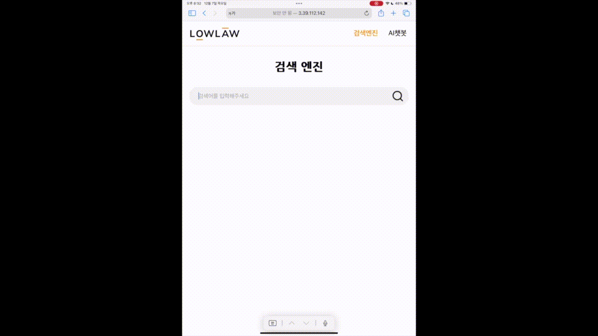

# 🏛️ LOWLAW

---

> **LOWLAW**는 법률 정보를 쉽고 빠르게 확인할 수 있도록 도와주는 서비스입니다.  
> 복잡한 법률 문서를 직접 찾지 않아도, LOWLAW를 통해 필요한 법률 정보를 간편하게 검색하고 확인할 수 있습니다.

---

## ✨ 기본 구성

    

---

## 📅 프로젝트 진행기간

- 2023.03 ~ 2023.12

---

## 🏆 성과

- 2023학년도 1학기 캡스톤디자인 경진대회 공과대학 부문 **입선** (2023.07)
- AWS와 함께하는 빅데이터 경진대회 **TOP4 총장상** (2023.09)
- AWS Rookie Championship **Elastic상** (2023.12)
- 2023학년도 2학기 캡스톤 디자인 경진대회 공과대학 부문 **대상** (2024.01)

---

## **LOWLAW 프로젝트**

- **“정보의 격차와 불균형을 줄이고 AI서비스로 법률사각지대를 밝히자”** 라는 목적을 가지고 유사서비스들의 한계점을 보완한 AI 서비스를 개발
- 사용자가 질문을 하면 그 질문과 유사한 질문에 대한 답변을 해주는 챗봇 기능과 법령과 판례 검색이 가능한 검색엔진 기능
- 검색엔진에 Elasticsearch Appsearch의 synonym기능으로 유사어로도 법령, 판례 검색이 가능

---

## 🎬 시연 영상

### 챗봇
- 
- 

답변에서 관련된 법령이나 판례가 나오면 버튼 클릭 시 검색엔진에 쿼리를 보내 해당 법령과 판례를 찾아줍니다.

### 검색엔진
- 
- 

법령의 정확한 명칭을 모르는 경우에도 유사한 검색어가 입력된다면 정확한 법령명으로 검색이 됩니다.

---

## 🏗️ 프로젝트 아키텍처

---

## **프로젝트 세부기능**

### 법령 판례 / 검색엔진 구현

1. 국가법령정보 공동 활용의 ([open.law.go.kr](http://open.law.go.kr/)) ‘현행법령 본문 조회 API’와 ‘판례 본문 조회 API’를 이용해 대량의 법령, 판례 데이터 크롤링 후 데이터 전처리를 통해 불필요한 정보 제거 및 특수 문자 정제 진행 후 ElasticCloud에 NoSQL 기반 데이터베이스 구성
2. 전처리 과정에서 법령은 법명과 조항호목을 구분하여 저장하여 조항호목 별로 모두 자세한 검색이 가능하도록 함
3. ElasticSearch AppSearch 내의 기능을 이용하여 검색엔진을 구현하였고 동의어사전 synonym을 구성하여 검색 편의성을 높였고 법명이 아닌 키워드로도 검색 가능
4. AWS Lambda의 기능을 통해 자동으로 법령의 시행일자를 확인하여 해당 일자가 되면 법령을 위에서 언급한 국가법령정보 공동 활용의 API를 통해 다시 크롤링하여 데이터베이스의 법령이 최신화되도록 데이터 파이프라인을 구성

### 챗봇 기능 구현

1. ‘공공데이터포털’의 <법무부 생활법률지식 정보 API> 크롤링 후 부동산임대차 관련 질문과 답변 데이터를 추출하여 ElasticSearch에 NoSQL 기반 데이터베이스 구축(챗봇 DB)
2. question 데이터베이스의 문장만 sentenceBERT 모델에 임베딩하여 얻은 문장벡터 값을 embedding 컬럼에 추가
3. 챗봇 사용자가 질문을 입력하면 해당 문장도 sentenceBERT모델에 임베딩하여 문장벡터 값 추출
4. 코사인유사도를 이용하여 챗봇 사용자의 질문과 챗봇 데이터의 DB question 문장벡터 유사도 계산
5. DB 챗봇 내의 가장 유사한 question 0.7의 코사인 유사도가 이상이라면 question answer 데이터에 해당하는 데이터 출력

---

## 🛠️ Trouble Shooting

- 초기에는 검색엔진을 TF-IDF 모델을 이용하여 검색어와 법령과 판례의 유사도를 구하고 streamlit으로 구현하려 했으나 RAM 1GB 제한 때문에 유사도 계산 시간이 너무 오래걸림
    - 교수님과 멘토님과의 피드백에서 Elasticsearch와 AWS을 추천받음
    - AWS와 Elasticsearch에 대한 학습을 위해 경희 캠퍼스타운에서 관련 특강을 수강
    - 개발 방향이 바뀌었기에 NoSQL 형태로 Elasitcsearch cloud에 DB를 재구축
- 법령은 시간이 지나면 개정이 되는데 매일 개정사항이 있는지 확인 후 DB 최신화 필요
    - 초기에는 당일에 개정되는 법령을 따로 수동으로 찾아서 바꿔주거나 통으로 매일 새로 크롤링하는 방향을 고려했으나 두 방법 모두 시간이 지나치게 오래 걸리거나 자원을 지나치게 낭비하는 방향
    - AWS의 lambda와 DynamoDB를 통해 당일에 개정되는 법령이 있는지 확인하는 함수를 만들고 당일이 개정일자인 법령이 있다면 해당 법령만을 크롤링하여 법령을 최신화하고 변경사항을 Elasticsearch의 DB에 적용되도록 함

---

## 📊 챗봇 사용자 데이터 대시보드 이미지 (KIBANA 이용)

---

# 🔗 관련 Github

- 초기 검색엔진 : [graduate_search_prototype](https://github.com/OnyX0000/graduate_search_prototype)
- AWS lambda 함수 : [LOWLAW-AWS-lambda](https://github.com/OnyX0000/LOWLAW-AWS-lambda)
- LOWLAW 프로젝트 : [Integrate](https://github.com/LOWLAW-TEAM/Integrate)

---
